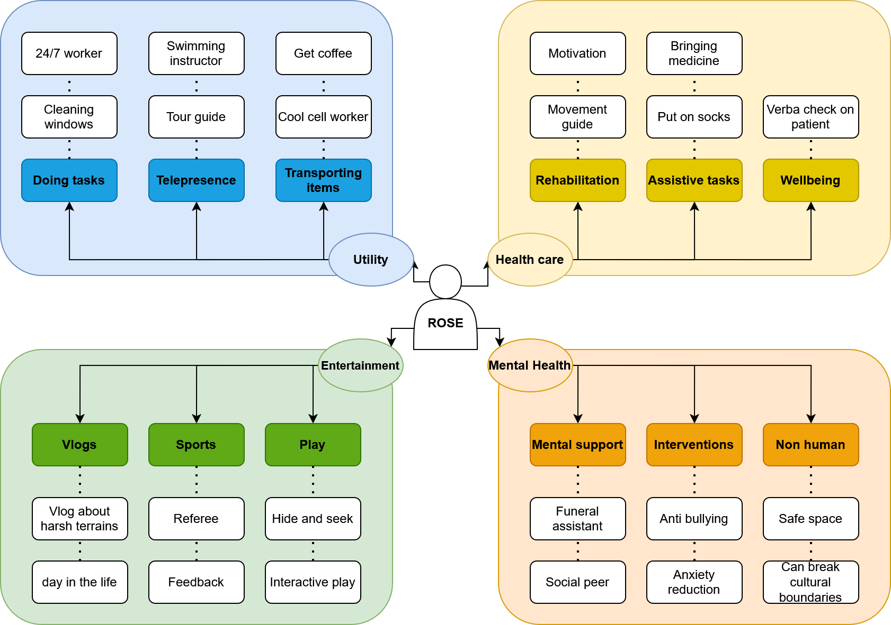
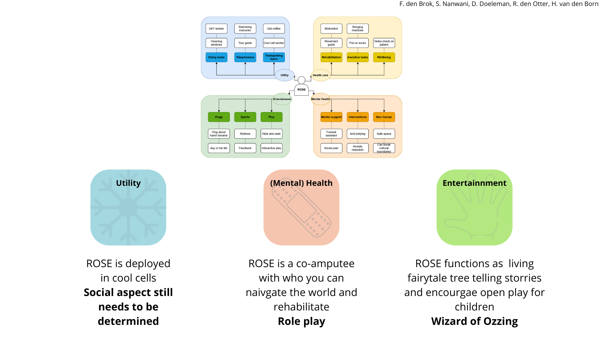

During the first project session of the course 'Social Robot Design' the main challenge is to explore different problem spaces in which the ROSE robot[^1] can be utilized. 

[^1]: (https://heemskerk-innovative.nl/news/new-version-of-robot-rose-tested-at-dutch-care-home)

## Brainstorm and creation of building blocks
During the brainstorm, my project group[^2] and I explored possible use cases for the ROSE robot. This was followed by the identification of several building blocks, which became the overarching themes of utility, healthcare, mental health, and entertainment. Below, the digitalized mind map consisting of the building blocks and problem space exploration can be seen.

[^2]: F. den Brok, S. Nanwani, D. Doeleman, R. den Otter, H. van den Born

/// caption
Digitalized version of the created mind map during the problem space exploration and the creation of the building blocks
///

## Functional breakdown

After the exploration of the problem space and the creation of the building block, my group[^2] and I all analyzed the outcome of the previous phase and determined interesting possible use cases for ROSE. A total of three interesting combinations and cases were identified. 

- For the building block of Utility, the idea to utilize ROSE in a cool cell came to mind. This can be a harsh environment, and providing some help via ROSE might be an interesting case. The interactive part of this option still needs to be explored.

- The building blocks of health care and mental health were combined in the idea to utilize ROSE as an amputation rehabilitation buddy. This would work especially well when a patient recently lost their arm. The idea is that ROSE also loses the functionality of one arm. This allows the patient to navigate the challenging and life-altering experience of losing an arm together with ROSE (who also has some challenges that need to be overcome due to the missing arm). A possible method to test this is by role playing.  

- The building block of entertainment was also explored by utilizing ROSE in interactive play. By combining open play with technology, social boundaries can be broken, and children might be able to play more freely. This can be tested via a Wizard-of-Oz method, in which there is a physically present ROSE that is controlled by a Wizard.

/// caption
Slide representing the three final cases for ROSE
///

[Next week](project2.md) one of these scenarios will be further explored.