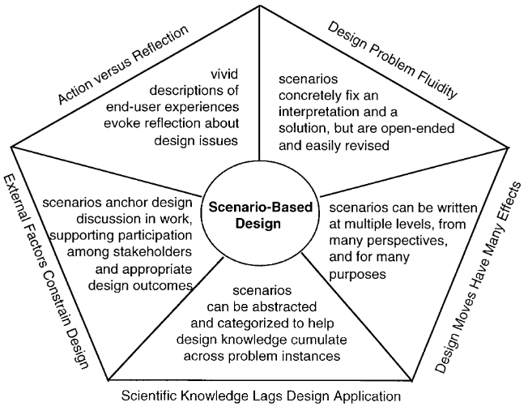
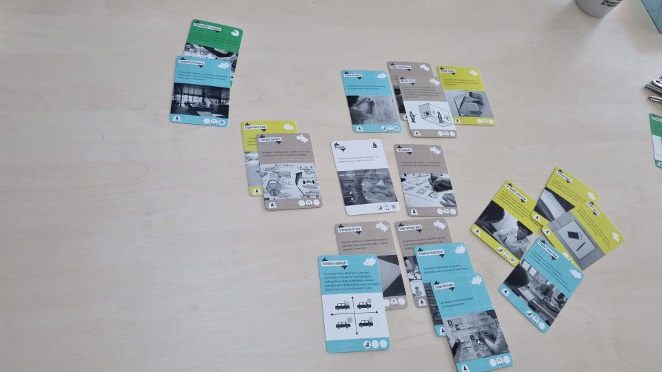
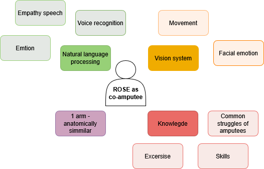
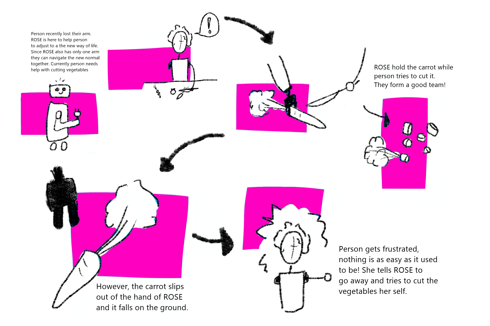

The aim of this week was to explore and create a story based design method. Carroll [^1] does a great job in describing the relevance and possibilities of scenario based design stating that it provides a flexible, reflective and layered method to explore possible design interactions. In addition, Carroll [^1] mentions that by abstracting scenarios, designers are able to find and recognize patterns and generalizations which in turn help a designer to address further challenges. 

/// caption
Identified challenges and the appropriate approaches of scenario based design, by Carroll [^1].
/// 

## Brainstorm methods
During the lecture my group and I [^2] explored several user centric design and research methods provided via the ‘User Innovation Toolbox’ [^3]. This exploration provided us with great insights in the currently available design methods and after reviewing all of them, we grouped them into categories. During this activity we identified several categories such as diary based methods, physical brainstorming methods and scenario based methods.

/// caption
Grouped brainstorm techniques using the 'User Innovatoin Toolbox' [^3].
/// 
[^1]: J. M. Carroll, ‘Five reasons for scenario-based design’, Interacting with Computers, vol. 13, nr. 1, pp. 43-60, sep. 2000, doi: 10.1016/S0953-5438(00)00023-0.
[^2]:  F. den Brok, S. Nanwani, D. Doeleman, R. den Otter, H. van den Born
[^3]: ‘User Innovation Toolbox’, Pelckmans Uitgevers. Accessed: May 6th  2025. [Online]. Available at: https://www.pelckmansuitgevers.be/user-innovation-toolbox.html
## Story Cubes
After the initial exploration of brainstorm methods we discussed which scenario based brainstorm methods we have used as a group and which ones we found most useful. The concept of story cubes was mentioned often and because of this, we decided to further investigate the technique. 

It was found that story cubes urge designers to create stories which are outside of their comfort zone. More often than not, a designer tends to create the perfect fitting story in which the product works well and has the intended effect. However, this approach does not allow for the critical exploration of a problem space and the creation of relevant and realistic prototypes. By utilizing story cubes, the designer does not have control over the main story line and therefore more scenarios can be explored [^4]. In addition to this, it was found that story cubes provide a collaborative way of story telling when done in a group. Lastly, it was stated by Bae et al. [^5] that the possible shaping and constraining character of story cubes can help to guide the scenarios, it can however also limit the creativity of a designer. 

[^4]: F. Weder, S. Lemke, en A. Tungarat, ‘(Re)storying Sustainability: The Use of Story Cubes in Narrative Inquiries to Understand Individual Perceptions of Sustainability’, Sustainability, vol. 11, nr. 19, p. 5264, sep. 2019, doi: 10.3390/su11195264.
[^5]: Bae, B.C., Seo, G. and Cheong, Y.G., 2016. Towards procedural game story creation via designing story cubes. In Interactive Storytelling: 9th International Conference on Interactive Digital Storytelling, ICIDS 2016, Los Angeles, CA, USA, November 15–18, 2016, Proceedings 9 (pp. 399-402). Springer International Publishing.

## Story Cubes and HRI
Even though story cubes can be considered a generalized brainstorm method, it can also serve as a very relevant brainstorm method in the context of HRI. This is caused by the fact that story cubes can be personalized to fit a certain context. To link the generalized concept of story cubes to HRI, the problem space of the ROSE robot as a co-amputee was further explored during one of the exercises of the lecture. 

/// caption
Digitalized exploration of ROSE as a co-amputee.
/// 

During this brainstorm several building blocks were found which were needed to create a robotic system that could function as a co-amputee. And with these building blocks in mind, several broader themes and applications can be identified: ROSE as mental support and ROSE as coach helping with tasks. This functioned as the basis for the creation of our story cubes.

## Dices
It was decided that a total of three dices would be created as part of our brainstorming method. Above, two main HRI themes have already been identified: ROSE as mental support (encouragement and aid) and ROSE as coach helping with tasks (Application area). These two categories will both receive their own story dice (below a more detailed elaboration on the story cubes can be found). In addition, the lessons and the reflections taught us that positive, negative and maybe neutral scenarios should be explored when it comes to HRI. Because of this, a third dice was added which can tell a designer which type of outcome a scenario should have. 

### Dice 1: Application areas which are linked to HRI 
Several application areas of HRI were found:

-	Living alone (task example: Cooking): The utilization of robots which might support physically challenged people at home is widely researched [^6]. Even though this might be a future scenario, this is an interesting application for HRI. 
-	Home assistance (task example: Cleaning): Supporting users in household tasks in another widely researched application of the field of HRI. By doing this, a higher quality of life might be created [^6]
-	Skill Training (task example: Gardening): After an amputation, the amputee needs to relearn a lot of skills. This requires a robot which can be used as a tutor to re-learn physical skills, in paper of Belpaeme et al. [^7] this use case was explored and considered promising.
-	Occupational Therapy (task example: Getting clothed): Not only hobbies require skills which need to be relearned after an amputation. A major focus of rehabilitation is relearning how to do basic daily tasks, an Robots could be a useful tool ofr this [^8]
-	Education (task example: doing hobbies which patient enjoyed before amputation)
-	Physical rehabilitation (task example: playing sports): The utilization of Robots is also being explored in the context of sports [^8]. We chose this as a unique category since it extends the physical therapy to a more intense way of movement. 

### Dice 2: Types of encouragement or aid
Several types of encouragement or aid can be provided by a robot. First of all, two types of feedback were identified based on the earlier described brainstorm: physical feedback and mental/ verbal feedback. 

**Mental/verbal feedback**

Three types of mental and verbal HRI feedback with respect to an amputee journey are identified:

-	Emotional feedback: Social robots can provide emotional feedback which in turn can lead to a positive long term interaction between the user and the robot [^9]. 
-	Deciding when to stop: Deciding when to stop might also be a hard thing to do during the recovery period. A Social robot might be a valuable feedback system. It was found that people are able to connect with social robots. When this feedback is provided in a human like manner, suggesting a non controlling robotic attitude, the robot can have a strong impact [^10].
-	Verbal instructions: As mentioned above, verbal instructions can be of great value in the field of social robotics. It was also found that verbal instructions can improve a learning outcome. This becomes clear in the work of Belpaeme et al. [^7], stating that A robot can provide verbal instructions. These instructions can help a person during hands-on tasks in the natural world [^7].

**Physical feedback**

In addition to verbal feedback, a robot might also provide physical feedback. A total of three different ways were reviewed:

-	Physical demonstration: Robots, especially humanoid robots, have the possibility to demonstrate physical movements. This could be utilized during rehabilitation sessions at home. A ROSE-like robot is utilized by Beraldo et al. [^11] to teach the correct arm movements during physiotherapy. 
-	Physical assistance in a task: In addition to just providing a physical demonstration, a robot might also assist a user during a task. This means that the robot and user would have to work together. 
-	Emotional body posture: Feedback and encouragement can be provided via speech; however a lot of our communication is done via body posture, and it was found by Olsson et al. [^12] that it is possible to create emotional body postures for social robots.  

[^6]: S. Bedaf, G. J. Gelderblom, en L. De Witte, ‘Overview and Categorization of Robots Supporting Independent Living of Elderly People: What Activities Do They Support and How Far Have They Developed’, Assistive Technology, vol. 27, nr. 2, pp. 88-100, apr. 2015, doi: 10.1080/10400435.2014.978916.
[^7]:  T. Belpaeme, J. Kennedy, A. Ramachandran, B. Scassellati, en F. Tanaka, ‘Social robots for education: A review’, Sci. Robot., vol. 3, nr. 21, p. eaat5954, aug. 2018, doi: 10.1126/scirobotics.aat5954.
[^8]: I. H. Han e.a., ‘Human-Robot Interaction and Social Robot: The Emerging Field of Healthcare Robotics and Current and Future Perspectives for Spinal Care’, Neurospine, vol. 21, nr. 3, pp. 868-877, sep. 2024, doi: 10.14245/ns.2448432.216.
[^9]: I. Leite, G. Castellano, A. Pereira, C. Martinho, en A. Paiva, ‘Empathic Robots for Long-term Interaction: Evaluating Social Presence, Engagement and Perceived Support in Children’, Int J of Soc Robotics, vol. 6, nr. 3, pp. 329-341, aug. 2014, doi: 10.1007/s12369-014-0227-1
[^10]: Torrey, C., Fussell, S.R. and Kiesler, S., 2013, March. How a robot should give advice. In 2013 8th ACM/IEEE international conference on human-robot interaction (HRI) (pp. 275-282). IEEE.
[^11]: G. Beraldo, A. Bajrami, A. Umbrico, G. Cortellessa, en M. C. Palpacelli, ‘AI-Enabled Framework for Augmenting Upper Limb Rehabilitation With a Social Robot’, in 2024 20th IEEE/ASME International Conference on Mechatronic and Embedded Systems and Applications (MESA), Genova, Italy: IEEE, sep. 2024, pp. 1-8. doi: 10.1109/MESA61532.2024.10704845.
[^12]: E. Mårell-Olsson e.a., ‘Navigating the Human–Robot Interface—Exploring Human Interactions and Perceptions with Social and Telepresence Robots’, Applied Sciences, vol. 15, nr. 3, p. 1127, jan. 2025, doi: 10.3390/app15031127.

### Dice 3: Outcome of the scenario
As earlier mentioned, the lectures and reflective assignments showed us that a designer should also consider negative outcomes and should move away from the ‘perfect scenario’. Because of this, a dice was added with three different outcomes (all three outcomes are mentioned twice on the dice since a dice has six sides 😊 )
This means that the content of this dice is:

-	2x Positive outcome: The robot allows for a positive outcome, or the robot allows for the intended outcome of the scenario.
-	2x negative outcome: The robot has a negative outcome on the outcome, or the robot does not provide the intended outcome of the scenario.
-	2x neutral outcome: The Robot does not have a significant effect on the outcome.

[^6]: S. Bedaf, G. J. Gelderblom, en L. De Witte, ‘Overview and Categorization of Robots Supporting Independent Living of Elderly People: What Activities Do They Support and How Far Have They Developed’, Assistive Technology, vol. 27, nr. 2, pp. 88-100, apr. 2015, doi: 10.1080/10400435.2014.978916.
[^7]:  T. Belpaeme, J. Kennedy, A. Ramachandran, B. Scassellati, en F. Tanaka, ‘Social robots for education: A review’, Sci. Robot., vol. 3, nr. 21, p. eaat5954, aug. 2018, doi: 10.1126/scirobotics.aat5954.
[^8]: I. H. Han e.a., ‘Human-Robot Interaction and Social Robot: The Emerging Field of Healthcare Robotics and Current and Future Perspectives for Spinal Care’, Neurospine, vol. 21, nr. 3, pp. 868-877, sep. 2024, doi: 10.14245/ns.2448432.216.

## Scenarios by group member S.Nanwami
After the creation of our HRI story cubes, all team members were asked to create a story using the dices. Once the activity was completed, all the stories created were reviewed together and it was found that a broad range of scenarios were created due to the restrictive nature of the dices. Below, two examples of the scenarios created can be found. I chose to add the scenarios created by S.Nanwami since they showcase two very different outcomes. 

**Gardening +  Verbal Instructions + Positive (Regular Scenario)**

The user tries to plant flowers which he has never done before. ROSE robot offers verbal instructions into how to plant these plants. i.e. “Dig a hole 5cm wide”, “Place the pot in the hole”, “cover the pot with soil”...
Through this, ROSE provides simple clear instructions into how to plant the plants properly. This will allow for the user to feel satisfied with the result since the plants will grow properly. Thus, a positive outcome is produced: The robot helps in teaching the user and gain more confidence

**Sports + Emotional Stimuli + Neutral (Speculative scenario)**

While the user is participating in a physical (sport) exercise, the robot is encouraging the user by providing them with emotional stimuli such as: “Keep it up!, “You are doing great”...
With this, the user might realize that they can play with the system and still receive this feedback without completing the task in hand. They could find a way to move the camera or just move in specific moments such as ROSE perceives that the user is completing the task. This would basically mean that ROSE will continue providing emotional feedback and encouragement without truly needing to since the user isn’t completing the task. 
This in essence leads to no improvement but not much harm either so the outcome is Neutral: The technology does not help or negatively impact the physical condition of the user.

## Story board of a scenario
Lastly, I created a story board of a scenario generated by R. den Otter.

/// caption
Story board negative scenario
/// 