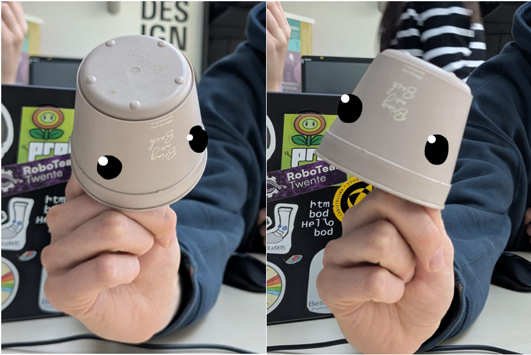
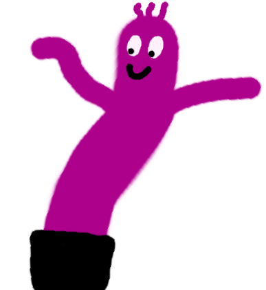
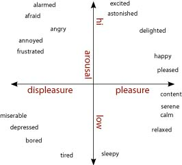
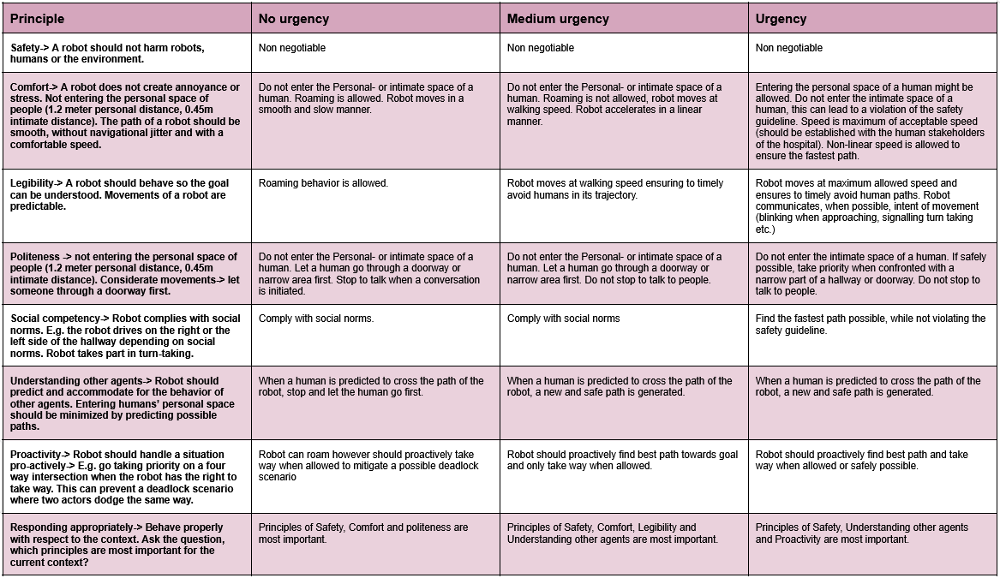
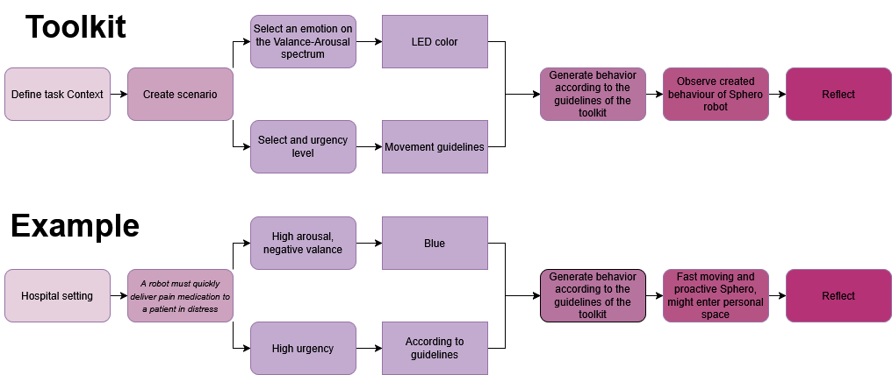

During the week’s lesson, an expressive toolkit was designed to explore the movement of a robot.

## Paper (or plastic) Robot Puppeteer Interaction
To explore the fact that emotional prototyping does not need expensive robots, materials, or extensive methods, an exercise was done during this week’s class. We used a cup with two squares on it (I drew eyes over them for better visibility). 
We tilted the cup up and down in an effort to convey emotions. This was surprisingly effective. When the cup ‘looked up’ it seemed happy or proud. And all of us were feeling some type of pity, which was expressed via an ‘aahhhwwww, sad’ when the cup looked down. 

/// caption
Cup looking sad/ashamed and proud/happy.
/// 

## Brainstorming
To find out how we wanted to create the design toolkit, my group [^1] and I first had a quick brainstorm on what we could use as a starting point of our motion/movement toolkit. We talked about windy-boys and how they are always happy even though they are forced to live outside (preferably during a storm). Their movements convey enthusiasm when blowing in the wind. However, when a windy boy gets stuck, it also conveys a sense of sadness. We also explored several easy-to-use, non-humanoid robots, such as the Sphero [^2] and the Dot robot [^3]. Their non-humanoid form might allow us to explore emotions without focusing on the aesthetics of a robot [^4]. In addition, the Sphero and Dot are both relatively low-cost and are highly intuitive to use and control. Lastly, we explored the possibility of a more tech-focused approach by utilizing a Kinect to mirror human emotional posture to a robot. This approach is linked to Wizard of Ozzing since it allows a user to easily map human posture to a robot. In the end, my group and I chose the Sphero robot as the basis of our toolkit due to its cost-effectiveness, intuitiveness, and greater freedom. 

[^1]: F. den Brok, S. Nanwani, D. Doeleman, R. den Otter, H. van den Born
[^2]: ‘STEM Kits & Robotics for Kids | Inspire STEM Education with Sphero’. Accessed: May 11th 2025. [Online]. Available at: https://sphero.com
[^3]: ‘Robots’, Wonder Workshop. Accessed May 11th 2025. [Online]. Available at: https://www.makewonder.com/en/robots/
[^4]: G. Hoffman en W. Ju, ‘Designing Robots With Movement in Mind’, Journal of Human-Robot Interaction, vol. 3, nr. 1, p. 89, mrt. 2014, doi: 10.5898/JHRI.3.1.Hoffman. 

/// caption
Drawing of Windy-man.
/// 

## Toolkit
After some discussion with the teacher, we also decided to focus on the hallway behavior of social robots in a hospital setting. For this specific case, my group and I decided to focus on how to convey urgency via movement and color. (The toolkit might be applicable for other emotions; however, due to the limited time, urgency was deemed relevant in a hospital setting.) 

For this toolkit, an emotion can be selected via the valence-arousal grid [^5]. This emotion will be linked to a color. After this is done, a level of urgency can be chosen (no urgency, some urgency, high urgency). This will be linked to movement guidelines, which will be described below. 

/// caption
Valance-Arousal spectrum by Feldman via Wikimedia [^5]. 
/// 

### Color
Color can be used to convey emotions, and therefore they also might be interesting to utilize when conveying a sense of urgency.

-   Green eyes in robots are often associated with positive emotions or attitudes such as friendliness, enjoyment, or joy [^6]. 
-   Yellow is often perceived as a neutral color. It does not convey a lot of specific emotions, however; it is still perceived as positive or friendly [^7]. 
-   Blue can be associated with more negative emotions or emotions that are on the low-valance side of the valance spectrum [^8]. 

[^5]: http://imagine-it.org/gamessurvey, English:  Psychologist Russell’s model of arousal and valence. 2009. Accessed May 12th. [Online]. Available at: https://commons.wikimedia.org/wiki/File:Valence-Arousal_Circumplex.jpg
[^6]: K. Koike et al., “Academic Emotions Affected by robot eye Color: An Investigation of Manipulability and Individual-Adaptability,” International Journal of Advanced Computer Science and Applications, vol. 10, no. 4, Jan. 2019, doi: 10.14569/ijacsa.2019.0100450.
[^7]: “Artificial emotion expression for a robot by dynamic color change,” IEEE Conference Publication | IEEE Xplore, Sep. 01, 2012. https://ieeexplore.ieee.org/abstract/document/6343772
[^8]: C. Liao and Y. Hsu, “Colour‐emotion association and colour preference for elder care robot appearance,” Coloration Technology, vol. 139, no. 4, pp. 369–384, Nov. 2022, doi: 10.1111/cote.12653.

### Movement
Implicit methods such as body movement and motion can be used to convey intent. When a robot has to convey urgency, it can be argued that a minimum of socialness should be conveyed. When reviewing the work of Francis et al. [^9] several guidelines to ensure social robot path finding and movement can be found: Safety, Comfort, Legibility, Politeness, Social Competence, Understanding other agents, proactivity, and responding appropriately. To create the movement component of the toolkit, the importance of adhering to these set guidelines will be discussed (with respect to the content of the paper [^9]). 

/// caption
Movement guidelines inspired by the paper of Francis et al. [^9]. 
/// 

[^9]: A. Francis e.a., ‘Principles and Guidelines for Evaluating Social Robot Navigation Algorithms’, J. Hum.-Robot Interact., vol. 14, nr. 2, pp. 1-65, jun. 2025, doi: 10.1145/3700599.

### Step-by-step plan of toolkit
Below a digital representation of the toolkit can be seen. In addition, an example scenario is worked out.

/// caption
Toolkit and example scenario.
/// 

### Video

After the creation of the toolkit, we explored several combinations of emotions and levels of urgency. Unfortunately the colors are not really visible in this video. 
<iframe width="560" height="315" src="https://www.youtube-nocookie.com/embed/lp1jXDmAECw?si=lKo0WCg8b0NQTwuf" title="Exploration of emotions and urgency Sphero" frameborder="0" allow="accelerometer; autoplay; clipboard-write; encrypted-media; gyroscope; picture-in-picture; web-share" referrerpolicy="strict-origin-when-cross-origin" allowfullscreen style="display: block; margin: 0 auto;"></iframe>

The expressive toolkit will be tested, evaluated, and linked to literature during the case study in [week 5](project5.md).