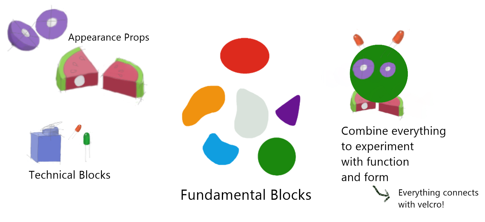

!!! warning
    Due to sickness, I was unable to attend the lecture on Embodiment, because of this I did not take part in the group work of this week since my group members [^1] were able to finish the work during the lecture. 

My group members designed a toolkit which can help researchers and designers to develop a fitting appearance for an interactive robot. The created toolkit consists of three types of building blocks which can be combined to experiment with the embodiment of a robot:

-	Fundamental blocks: Basis shapes in different shapes and colors can be utilized as the basis of the robot. These fundamental blocks will be fully covered in Velcro to allow a designer to stick another block onto it. 
-	Additional props: A unique appearance of the robot, in addition to facial expression can be achieved by utilizing different types of wooden fruits and vegetables. These wooden foods can be ‘cut’ since they are held together with Velcro. The wooden food parts can be Velcro-ed onto the fundamental blocks.
-	Technical building blocks: The technical part of a social robot can be added via the technical blocks. My group added these types of blocks to allow for the exploration of socialness and technical capabilities of a robot. Examples of technical blocks are servo motors, LED screens, LED lights, buttons, speakers, a camera module, two grabbing claws and multiple attachable wheels. These technical blocks can Velcro-ed to the fundamental blocks. 

 My group chose to make the components modular to allow for the exploration of a wide range of robots and types of embodiments. 

To provide a bit of guidance during the embodiment exploration, a user is asked to provide some input, which is later mapped to colors, shapes and technical blocks. 

-	First the user is asked if there is a target emotion. When the emotion is positive, a yellow fundamental block in a circular shape is suggested. When the target emotion is neutral, a green fundamental block with a square or rectangular shape is suggested. When the target emotion is negative, a blue triangular fundamental block is suggested. The mapped colors were found in the work of Jonauskaite & Mohr [^2] and Kumarasamy et al. [^3]. The mapped shapes were found by reviewing the works of Strohmeier et al. [^4],[^5]
-	After this, the user is asked about the preferred type of feedback. This input is mapped to one, or two relevant and fitting technical building blocks. 
-	Lastly, the target group is asked. When the target group are children, the block sizes will be smaller and when the target groups consist of adults larger blocks will be utilized. 

[^1]: F. den Brok, S. Nanwani, D. Doeleman, R. den Otter

[^2]: D. Jonauskaite and C. Mohr, “Do we feel colours? A systematic review of 128 years of psychological research linking colours and emotions,” Psychonomic Bulletin & Review, Jan. 2025, doi: 10.3758/s13423-024-02615-z.

[^3]: J. Kumarasamy, P. D. Apayee, and M. Subramaniam, “Emotion and Expression Responses Through Colour: A literature review,” SSRN Electronic Journal, Jan. 2014, doi: 10.2139/ssrn.2435741.

[^4]: P. Strohmeier, J. P. Carrascal, B. Cheng, M. Meban, and R. Vertegaal, “An Evaluation of Shape Changes for Conveying Emotions,” Researchgate, May 2016, doi: 10.1145/2858036.2858537.

[^5]: P. Strohmeier, J. P. Carrascal, B. Cheng, M. Meban, and R. Vertegaal, “An Evaluation of Shape Changes for Conveying Emotions,” ACM Digital Library, May 2016, doi: 10.1145/2858036.2858537.

/// caption
Designed embodiment toolkit designed by group[^1], drawn by me.
/// 

