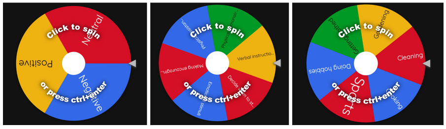
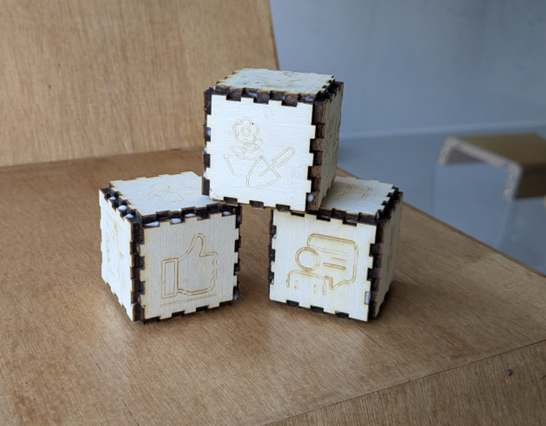
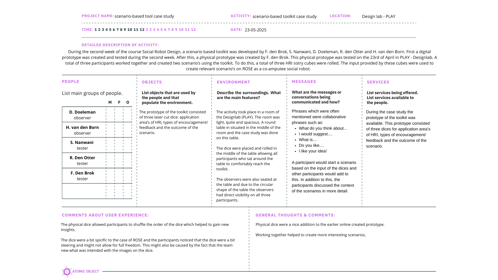
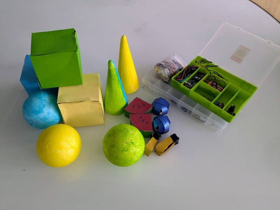
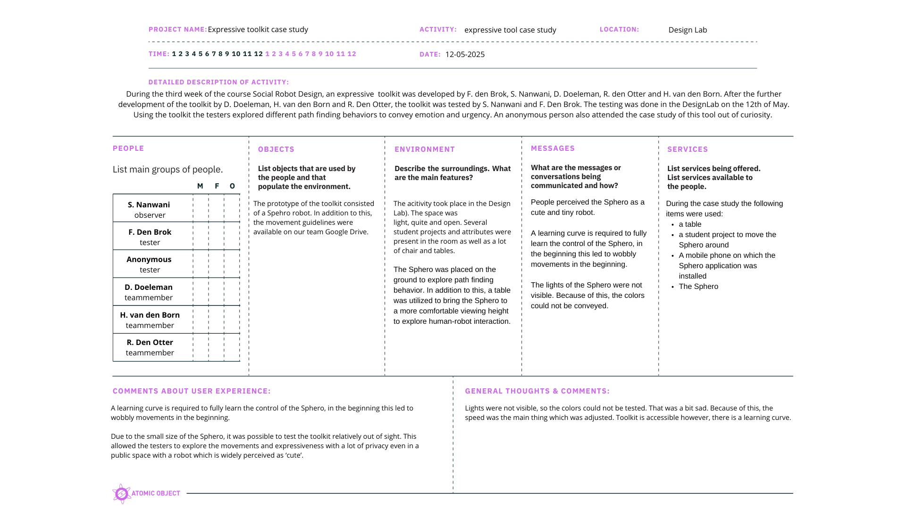
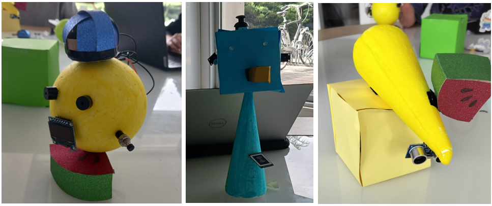

During this week’s project meeting a case study was conducted to test the created toolkits. During the past weeks the prototypes created have already been tested. However, where possible, a more advanced prototype was created and used during the case study of this week. 

## Toolkit 1: A scenario-based toolkit

The first toolkit which was created for this course was a scenario based toolkit. 

/// caption
Online prototype scenario based tool
/// 

However, to test the toolkit in a physical and collaborative setting, three physcical dice were created:

/// caption
HRI dices prototype
/// 

/// caption
POEMS framework [^1] scenario-based toolkit case study [^1]
/// 

[^1]: ‘POEMS – Research Tool - Nova’. Accessed: May 25th 2025. [Online]. Available at: https://novatools.org/poems-research-tool/

## Toolkit 2: An expressive toolkit

The second toolkit was not itterative upon this week since it was already tesed in detail and it was not possible to gain access to a Sphero robot in time. Below, a video can be found which was recored during the fourth week of this course.

<iframe width="560" height="315" src="https://www.youtube-nocookie.com/embed/lp1jXDmAECw?si=lKo0WCg8b0NQTwuf" title="Exploration of emotions and urgency Sphero" frameborder="0" allow="accelerometer; autoplay; clipboard-write; encrypted-media; gyroscope; picture-in-picture; web-share" referrerpolicy="strict-origin-when-cross-origin" allowfullscreen></iframe>

After a reflective conversation with the entire group, it was still possible to fill in the POEMS framework.

![POEMS framework expressive toolkit case study](images/1.png
/// caption
POEMS framework [^1] expressive toolkit case study
/// 

## Toolkit 3: An embodiment toolkit
After a digital visual prototype, a paper prototype was created to test the embodiment toolkit. 

/// caption
Embodiment prototype
/// 

/// caption
POEMS framework [^1] embodiment toolkit case study
/// 

After the case study, the follow three emodiment explorations were created:

/// caption
Results of the embodiment case study
/// 