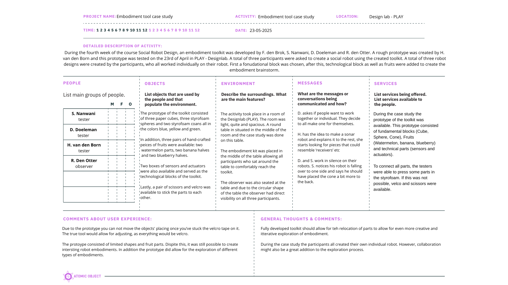

During this week’s project meeting a case study was conducted to test the created toolkits. During the past weeks the prototypes created have already been tested. However, where possible, a more advanced prototype was created and used during the case study of this week. 

## Toolkit 1: A scenario-based toolkit

The first toolkit which was created for this course was a [scenario based toolkit](project2.md). 

/// caption
Online prototype scenario based tool
/// 

However, to test the toolkit in a physical and collaborative setting, three physcical dice were created by F. den Brok:

/// caption
HRI dices prototype
/// 

### case study
A casestudy was conducted in Design lab. During this case study my group and I [^2] tested this toolkit by rolling the dices and creating scenario's:

-  Positive, emotional feedback/talking, arts/hobbies: Misses Johnson in knitting in the common room of the care house, her motoric skills are not what they used to be and she made some mistakes. In frustration she tried to take down her work when ROSE notices. ROSE asks her: why did you put it down, you were doing great? We can work it out together. On her screen she showes a possible fix and they work it out together. 
-  Working together, gardening, negative outcome: Bob and ROSE are working in the garden together, to finish the work fatser Bob provides ROSE with speciic tasks and they split up the work. ROSE goes across the field instead of going to the pavement on the freshly mowed lawn, and runs over potatoes starting to grow. Bob gets angry and frustrated. Bob calls ROSE but ROSE does not receive the message and continues on with her task. Bob is frustrated and disconnects ROSE.

 Below a filled in POEMS framework can be seen:

/// caption
POEMS framework [^1] scenario-based toolkit case study [^1]
/// 

[^1]: ‘POEMS – Research Tool - Nova’. Accessed: May 25th 2025. [Online]. Available at: https://novatools.org/poems-research-tool/
[^2]: F. den Brok, S. Nanwani, D. Doeleman, R. den Otter, H. van den Born

### Insights after testing
After testing of the toolkit we concluded that the dice are a nice tool to explore scenario's. They provide some guidance however the open ended charcter of the dice allow a designer to create out of the box scenarios. Especially the dice about the outcomes of the scenario's allow for a nice exploration. I found it really nice to be forced to also think about possible negative and neutral outcomes of the scenario's. The scenario of ROSE and Bob is a good example of this. As a designer it reminds me to also think about the possibility of ROSE not hearing or understanding an communication effort. It allows me to rethink what the minimum range of the microphones of the robot are and if a robot should be able to hear everything. This does show that storytelling can take on an important role in a design process and therefore I do support the quote of Thomas Erickson shared during the lecture of week 2:

!!! quote
    Design is a distributed social process, and, as a result, communication plays a vital role. [^3]

[^3]: Erickson, T. (1996). Design as storytelling. interactions, 3(4), 30-35.http://doi.org/10.1145/234813.234817

The link to HRI of the digital a bit too specific which lead to less creative freedom. To mitigate this, storycubes with only symbols were created. By doing this, the link to HRI became a bit more implicit instead of explicit however it did allow for more conversation. In addition to this, we disussed if the physical story cubes were more beneficial over the digital prototype. We found that the physical stoy cubes provide a sense of control since you are able to shuffle the order of the dice and you are bale to pass the dice over to another team member. 

## Toolkit 2: An expressive toolkit

[The expressive toolkit](project3.md) was not iterated upon this week since it was already tesed in detail and it was not possible to gain access to a Sphero robot in time. Below, a video can be found which was recored during the third week of this course.

<iframe width="560" height="315" src="https://www.youtube-nocookie.com/embed/lp1jXDmAECw?si=lKo0WCg8b0NQTwuf" title="Exploration of emotions and urgency Sphero" frameborder="0" allow="accelerometer; autoplay; clipboard-write; encrypted-media; gyroscope; picture-in-picture; web-share" referrerpolicy="strict-origin-when-cross-origin" allowfullscreen></iframe>

After a reflective conversation with the entire group, it was still possible to fill in the POEMS framework.

/// caption
POEMS framework [^1] expressive toolkit case study
/// 

### Insights after discussion
During the discussion we as a group had about our expressive toolkit we discussed to outcome of our test. During the test a Sphero robot was used and this was a good choice since the lack of humanized features on the timy robot ball allowed us to only review the movement and expression without being distracted. The Sphero was however a bit hard to control and the colors of the ligths were not really visible. Despite this, the toolkit provided us a good foundation to test the expression of urgency through movement. It was concluded by the group that especially high urgency and a low level of urgency (roaming behavior) were expressible via movement patterns. The level of some urgency was a bit harder to convey since it relied on a lot of nuances. 

The toolkit was created based on the guidelines for social robot path finding by Francis et al. [^4]. Because of this, it is no surprise that it was possible to recognize certain behaviors of the Sphero robot. 

[^4]: A. Francis e.a., ‘Principles and Guidelines for Evaluating Social Robot Navigation Algorithms’, J. Hum.-Robot Interact., vol. 14, nr. 2, pp. 1-65, jun. 2025, doi: 10.1145/3700599.

## Toolkit 3: An embodiment toolkit
After a [digital prototype](project4.md), a paper prototype was created by me to test the embodiment toolkit. Three of the participants were tasked with cretaing an robot embodiement which suited their wants and needs. The social guidelines (Safety, Comfort, Legibility, Politeness, Social Competence, Understanding other agents, proactivity and responding appropriately) also have simmillarities with the work of Cyntia Breazeal on the first social Robot: Kismet [^5]. In addition to this, the creation of an expressive toolkit through movement showed resemblance with the work of Laban [^6] in which the space, weight and flow/time of a motion could be used to convey emotions. 

[^5]: C. L. (Cynthia L. Breazeal, ‘Sociable machines : expressive social exchange between humans and robots’, Thesis, Massachusetts Institute of Technology, 2000. Geraadpleegd: 3 juli 2025. [Online]. Beschikbaar op: https://dspace.mit.edu/handle/1721.1/9303

[^6]: ‘Laban movement analysis’, Wikipedia. September 27th 2024. Accessed May 14th [Online]. Available at: https://en.wikipedia.org/w/index.php?title=Laban_movement_analysis&oldid=1248108012

/// caption
Embodiment prototype
/// 

/// caption
POEMS framework [^1] embodiment toolkit case study
/// 

The following three robot embodiements were created (from left to right):

- The robot should be a positive and approachable robot which finds its way through sonar. To achieve this, two speakers were placed on the fundamental block and represented the eyes of the robot. In addition, a blueberry representing the receiver was added to the robot.
- The blue color was used to evoke calm and negative, sad emotions, since this robot is a robot to talk to when you are sad and therefore it needs to be empathic and show it feels you. Ears since it can hear and make sounds (beeps). I also gave it a nose and eyes since it is a social robot which is made for interaction with humans. The joystick on the head can be used to provide input in the robot and set it to different modes such as listening, cheering up, wake up and sleep. 
- The robot is meant to represent a sort of pet buddy which helps in tasks and guiding around the house choirs. The yellow colour is meant to represent a calm and happy robot that I'd always there to support. The top cone can rotate to help detect where to clean up, the watermelon can tilt up and down to indicate where to go and the tail in the back (banana) can jiggle to índice a trouble had been found.

/// caption
Results of the embodiment case study
/// 

### Insights after testing 
After the testing we conluded that the color coding of the robot is a bit simplified since colors can be used for way more than only conceying an emotion. A total of three different and interesting embodiments were created. A bigger variety of fundamental blocks, or mouldable fundamental blocks would provide a more realistic exploration. The velcro allowed for full exploration of the physical body of the robot and the technical components were varied and allowed for the exploration of functionalities. 

The combination of fundamental blocks and technical blocks allowed us to explore not only the technical, and robotic capabilities of a robot, but also the social aspects of the design. During the reflection of [week 4](reflection4.md) user centered design methods were discussed. These methodologies do not only look at what a robot should do, but also how a robot should do things or how a robot should be percieved. By exploring the embodiement of a robot via shapes and fruits the look and feel of a robot can be altered to match, or purposfully mismatch the intented use of a robot. It also allows a designer to explore the balance between form and function. 