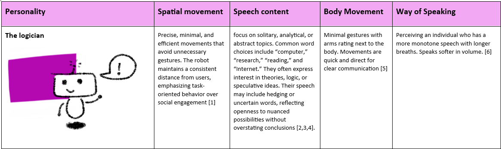
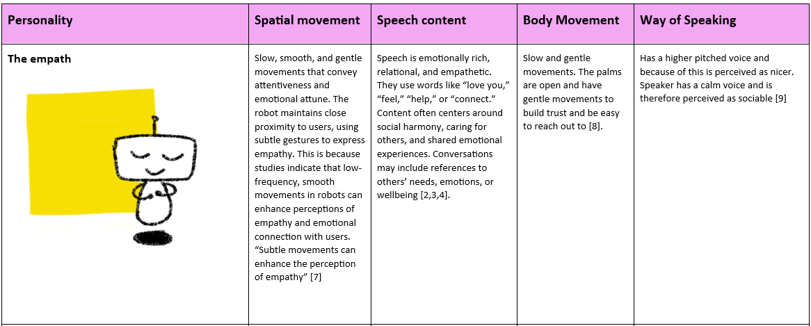
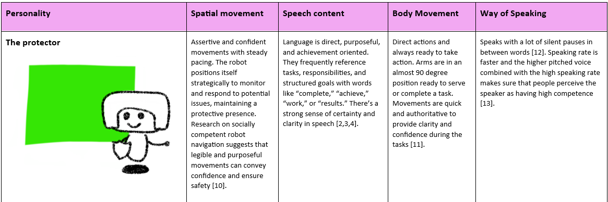
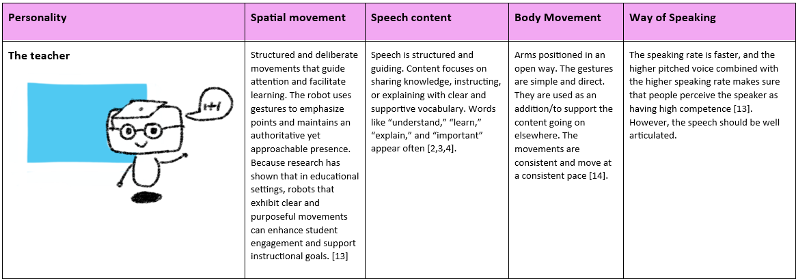
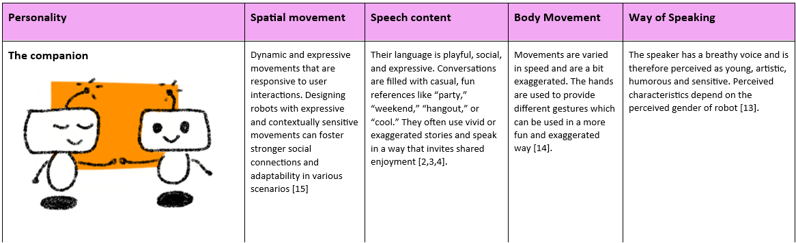

During this week's project session a behavior toolkit was created by my group and I (F. den Brok, S. Nanwani, D. Doeleman, R. den Otter, H. van den Born). The tool should preferrably not rely on a Wizard of Oz. At the beginning of the lecture we talked about the difference between the behavior- and expressive toolkit. After a brief discussion we concluded that in our eye's the expressive toolkit had a stronger focus on non verbal communication and expressiveness while behavior is more about the overaching image. Behavior is more that movement and expression, it inlcudes the way you talk, the way you move, the valance of your actions and more. We wanted to incorporate this and after some more brainstroming we decided that it might be interesting to create different ROSE personality cards. We were inspired by the 16 personality types [^16] and the concept of Dungeons and Dragons [^17] in which you can shape your own character and narrative. In addition to this, we found that personality can be of hughe influence on how people behave them selves [^18]. By using personalitie types we aim to create a tool which can be utilized to explore the behavior of ROSE in a lot of different settings. In addition, the tool might allow for the customization of care robots to specifically fit patient needs.

### Working of the toolkit
The toolkit works as follows: A caregiver or deisgner can select a personality type for ROSE. When a caregiver chooses the personlaity type they can use the patient history and knowledge about the patient to select a fitting character type. In addition to this, an interaction designer can also explore behavior in different social settings with this tool. The designer can design their own character sheets or use one of our created sheets. 

The five personalities were based on literature. We acknowlegde that personalities are not always so straight forward as presented below, however for the aim of this ourse a total of 5 personality types were chosen:

### ROSE the logician

/// caption
ROSE as the logician.
/// 

### ROSE the empath

/// caption
ROSE as the empath.
/// 

### ROSE the protector

/// caption
ROSE as the protector.
/// 

### ROSE the teacher

/// caption
ROSE as the teacher.
/// 

### ROSE the companion

/// caption
ROSE as the companion.
/// 

The behavioural toolkit will be tested, evaluated and linked to literature during the case study in [week 8](project8.md)

[^1]: https://www.cogniron.org/final/RA3.php  "COGNIRON - The Cognitive Robot Comp
[^2]: Schwartz, H. A., Eichstaedt, J. C., Kern, M. L., Dziurzynski, L., Ramones, S. M., Agrawal, M., ... & Ungar, L. H. (2013). Personality, gender, and age in the language of social media: The open-vocabulary approach. PLOS ONE, 8(9), e73791. https://doi.org/10.1371/journal.pone.0073791
[^3]: Tausczik, Y. R., & Pennebaker, J. W. (2010). Personality and language use in self-narratives. Journal of Research in Personality, 44(4), 463–470. https://doi.org/10.1016/j.jrp.2010.05.003
[^4]: Yarkoni, T. (2010). Personality in 100,000 words: A large-scale analysis of personality and word use among bloggers. Journal of Research in Personality, 44(3), 363–373. https://doi.org/10.1016/j.jrp.2010.04.001
[^5]:  https://www.cogniron.org/final/RA3.php  "COGNIRON - The Cognitive Robot Companion"
[^6]: = S. Lee, J. Park, en D. Um, ‘Speech Characteristics as Indicators of Personality Traits’, Applied Sciences, vol. 11, nr. 18, p. 8776, sep. 2021, doi: 10.3390/app11188776.
[^7]: [1]: https://arxiv.org/abs/2209.00983  "The Effect of Robot Posture and Idle Motion on Spontaneous Emotional Contagion during Robot-Human Interactions"
[^8]: https://www.researchgate.net/publication/286516732_The_Effects_of_Hand_Gestures_on_Psychosocial_Perception_A_Preliminary_Study 
[^9]: A. Guidi, C. Gentili, E. P. Scilingo, en N. Vanello, ‘Analysis of speech features and personality traits’, Biomedical Signal Processing and Control, vol. 51, pp. 1-7, mei 2019, doi: 10.1016/j.bspc.2019.01.027.
[^10]: https://dl.acm.org/doi/full/10.1145/3495244  "Social Momentum: Design and Evaluation of a Framework for Socially Competent Robot Navigation | ACM Transactions on Human-Robot Interaction"
[^11]: https://ieeexplore.ieee.org/document/6630743
[^12]: S. Lee, J. Park, en D. Um, ‘Speech Characteristics as Indicators of Personality Traits’, Applied Sciences, vol. 11, nr. 18, p. 8776, sep. 2021, doi: 10.3390/app11188776.
[^13]: https://link.springer.com/article/10.1007/s10639-022-11132-2  "The dual role of humanoid robots in education: As didactic tools and social actors | Education and Information Technologies"
[^14]: https://link.springer.com/article/10.1007/s10639-024-12570-w
[^15]: https://dl.acm.org/doi/10.1145/3568294.3580075  "Designing Robotic Movement with Personality | Companion of the 2023 ACM/IEEE International Conference on Human-Robot Interaction"
[^16]: ‘Personality Types | 16Personalities’[Online]. Available at: https://www.16personalities.com/personality-types, https://www.16personalities.com/personality-types
[^17]: https://www.dndbeyond.com/
[^18]: W. Ickes, M. Snyder, en S. Garcia, ‘Personality Influences on the Choice of Situations’, in Handbook of Personality Psychology, Elsevier, 1997, pp. 165-195. doi: 10.1016/B978-012134645-4/50008-1.
