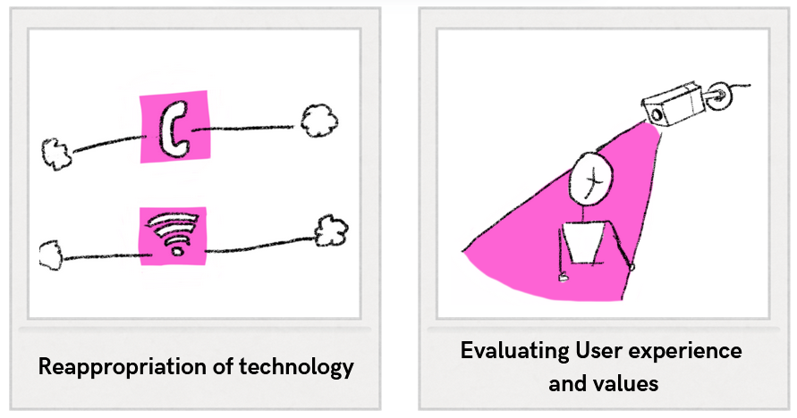
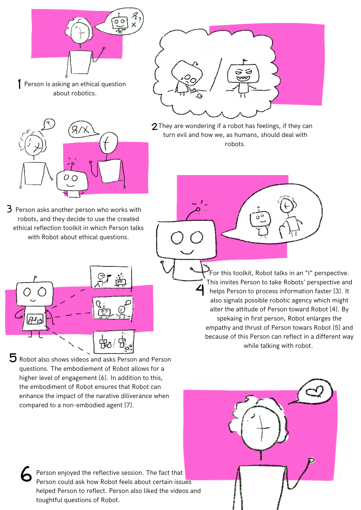

During the lesson of this week, an ethical toolkit was created.

## Exploration of Ethical Toolkit
At the beginning of the lesson, several ethical toolkits could be explored. My group and I chose to explore the Envision Cards [^2]. It worked as follows: one of the group members picked a random card and read the content out loud. The content of the card could be used to foster ethical discussions. 

The first card that was picked revolved around the concept of re-appropriating old technology. The card used the cellphone wire network as an example. In this day and age, everyone has a mobile phone, and a landline is often redundant. However, the cellphone wires were repurposed to carry internet towards people's homes. 

The second card that was picked revolved around the evaluation of user experience and values. We talked about cameras in public places and about the question of whether it would be a problem if there was a person watching all the camera footage. It helped us discuss the fact that there might be a mismatch between the intent of the designer and how the users experience the effects of the problem. In regard to the camera, the intent is to enlarge public safety; however, it might also make people feel watched or cause a privacy breach.

/// caption
Envision cards discussed by the group.
/// 

[^2]: ‘Envisioning Cards’, DECKAHOLIC. Accessed 8th of June, 2025. [Online]. Available at: http://www.deckaholic.com/lib/envisioning-cards

## Created Ethical Toolkit
During the lesson, my group and I [^1] explored the possibility to involve a robot in an ethical discussion. It was suggested that the embodiment of the robot could lead to interesting results and that it might be interesting to utilize a robot with a screen (for example, a Pepper robot) to also show videos. The robot can ask questions about the video and talks from an "I" perspective. Below, a storyboard of our ethical toolkit is depicted:

/// caption
Ethical toolkit [^3], [^4], [^5], [^6], [^7]
/// 

In the [reflection](reflection7.md) of this week, the question of whether a robot should be a stakeholder in ethical discussions will be evaluated, and they will be tested, evaluated, and linked to literature during the case study in [week 8](project8.md)

[^1]: F. den Brok, S. Nanwani, D. Doeleman, R. den Otter, H. van den Born
[^3]: T. Ye, T. Minato, K. Sakai, H. Sumioka, A. Hamilton, en H. Ishiguro, ‘Human-like interactions prompt people to take a robot’s perspective’, Front. Psychol., vol. 14, p. 1190620, okt. 2023, doi: 10.3389/fpsyg.2023.1190620.
[^4]:G. A. Abbo, T. Belpaeme, en M. Spitale, ‘Concerns and Values in Human-Robot Interactions: A Focus on Social Robotics’, 2025, arXiv. doi: 10.48550/ARXIV.2501.05628.
[^5]:A. Pipitone, A. Geraci, A. D’Amico, V. Seidita, en A. Chella, ‘Robot’s Inner Speech Effects on Trust and Anthropomorphic Cues in Human-Robot Cooperation’, 2021, arXiv. doi: 10.48550/ARXIV.2109.09388.
[^6]: T. Nishio e.a., ‘The Effects of Physically Embodied Multiple Conversation Robots on the Elderly’, Front. Robot. AI, vol. 8, p. 633045, mrt. 2021, doi: 10.3389/frobt.2021.633045.
[^7]:S. Costa, A. Brunete, B.-C. Bae, en N. Mavridis, ‘Emotional Storytelling using Virtual and Robotic Agents’, 2016, arXiv. doi: 10.48550/ARXIV.1607.05327