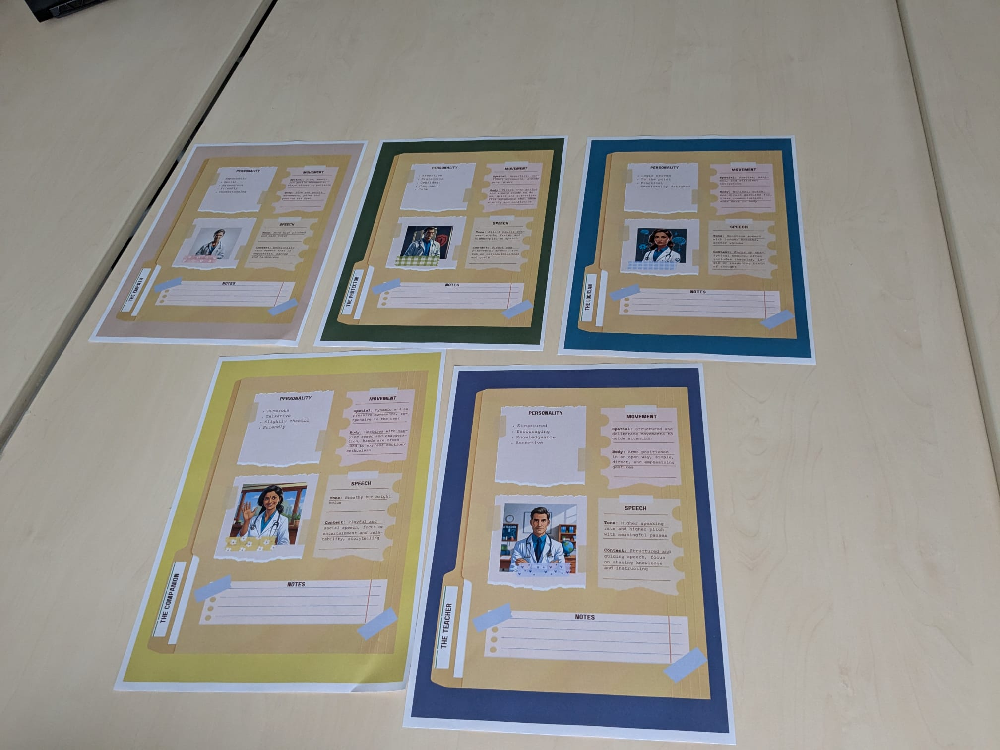
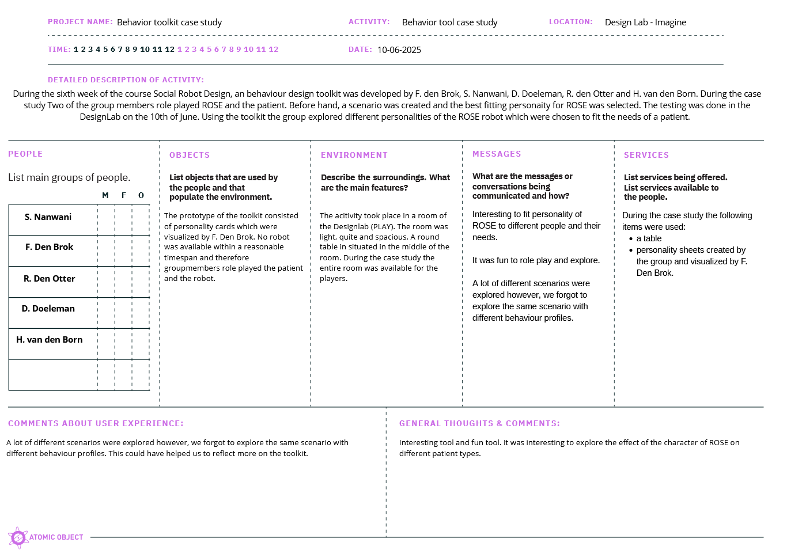
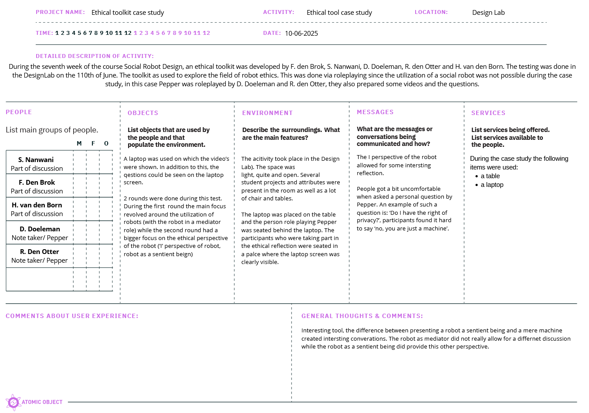

---
hide:
  - footer
---

During this week’s project meeting a case study was conducted to test the created behavior- and ethical toolkits. 

## Tookit 4: Behavioral toolkit
During the [sixth week](project6.md) of this course a behavioral toolkit was created by my group and I [^1]. To test this toolkit a total of five character sheets were physicalized by F. den Brok:

/// caption
Personality sheets physicalized by F. den Brok.
/// 

To test this toolkit we took inspiration from the theater style type of exploration as shown during multiple lectures. A total of three groupmembers part took in the role playing, the other two group members wathced and took on the role of observer and notetaker. The toolkit was tested during the following scenario:

- ROSE is a care robot which is being utilized in an elderly care home. In this elderly care home the patients need personalized care. A caregiver who nows the patients chooses the fitting personality type for ROSE and after this ROSE is ready to help the patients. 

Below a video of two of the runs can be found. The first patient was a grumpy old man who only wants to take ble pills. Unfortunately his pills are not blue. The caregiver selected the protector personality for ROSE since the paient needs clear communication and a firm hand. During the second scenario ROSE encounters an old lady who is roaming around the halls of the care home. Unsure how to get back to the living room she accepts the assistance of ROSE who is progammed as an empath.

<iframe width="560" height="315" src="https://www.youtube-nocookie.com/embed/sDCIbt0dpWc?si=sDCIbt0dpWcuf" title="Exploration of different ROSE personalities" frameborder="0" allow="accelerometer; autoplay; clipboard-write; encrypted-media; gyroscope; picture-in-picture; web-share" referrerpolicy="strict-origin-when-cross-origin" allowfullscreen></iframe>

The video above was published with the consent of the people who were filmed. However, to protect their privacy online, the roles POEMS framework below are not specified. This to ensure that the names of the people visible in the video are not directely linkable to their image. 

/// caption
POEMS framework [^2] behavioural toolkit case study.
/// 

### Insights after testing
The behavioural toolkit allowed us to explore the influence of different personalities of ROSE. The theater approach also allowed for fun 

## Tookit 5: Ethical toolkit

/// caption
POEMS framework [^2] ethical toolkit case study.
/// 

[^1]: F. den Brok, S. Nanwani, D. Doeleman, R. den Otter, H. van den Born
[^2]: ‘POEMS – Research Tool - Nova’. Accessed: May 25th 2025. [Online]. Available at: https://novatools.org/poems-research-tool/