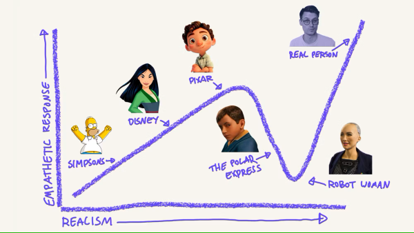
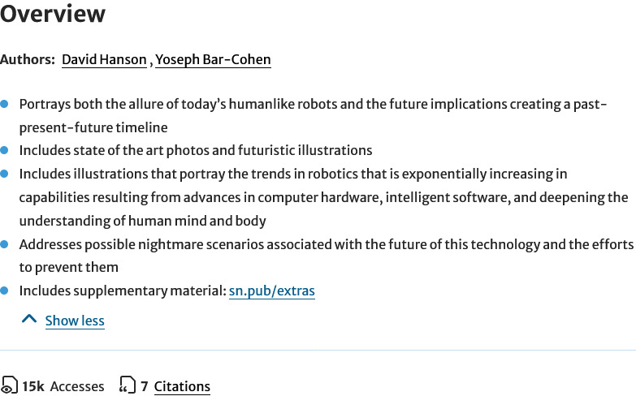
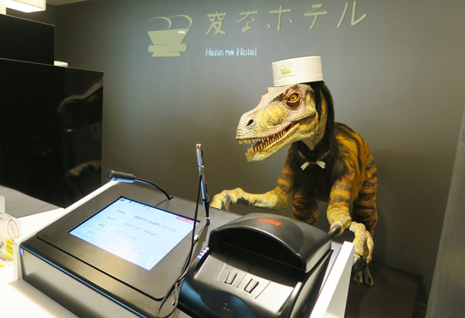
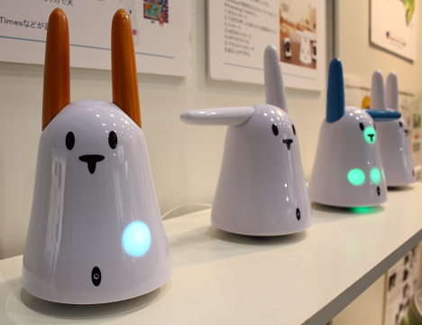

## How is design research linked to HRI?

Several pointers to a design research approach with respect to social robots are given. First, the concept of anthropomorphy, or the modelling of machines as human beings, was discussed. According to the authors of this chapter[^1], the rise and accessibility in open source robot hardware has allowed a lot of people to create robotic systems in which human artifacts can be recognized. These human artifacts are linked to the human ability to find a face or a human capacity for communication in an object, animal or, in this case, social robot. These human artifacts lead me to the second pointer. An understanding of these human artifacts in social robots is needed.

[^1]: Vincent, J., Taipale, S., Sapio, B., Lugano, G., & Fortunati, L. (Eds.). (2015). Social robots from a human perspective, Springer. doi:10.1007/978-3-319-15672-9

Another pointer which I found while reading Chapter 8 was the impact of the open source community on the research field of social robotics. Allowing open source experimentation can provide large amounts of prototypes, interactions, robots, and research. An example mentioned by the authors of Chapter 8 is the Arduino company. This company provides open source hardware which can be used to create all kinds of systems.

Lastly, some interesting considerations are provided with respect to the design of social robots.

-   The system should be intuitive and easy to use. This entails that simple interfaces are preferred which allow non expert users to also interact with the system.
-   The face and facial expression of a robot are important. These two aspects are important since communication is done verbally but also non-verbally. To create the most intuitive social behavior, human artifacts should be mimicked. 
-   It is important to design a social system in such a way that a user does not experience uncanny valley. This is a phenomenon in which the user feels uneasy due to the high, yet imperfect, human resemblance of a robot. 

/// caption
The uncanny valley of personalization, from Mac Reddin[^2]
///

[^2]: Mac Reddin - https://www.linkedin.com/pulse/uncanny-valley-personalization-mac-reddin-/

## Digital vs. Embodiment

The author of Chapter 9[^1] introduces the idea of a mobile phone as an emotionalized personal robot. By collocating with its user via haptic properties such as gaze and vibration, a mobile phone can stimulate actions or create emotions. In addition to this, the mobile phone is a highly personalized and adaptable device which allows a user to shape the content in a unique way. In addition to this, the author mentioned that the user of a mobile phone can explore their (emotional) self without needing to communicate with others. This highly intimate relationship can also be seen through all the personal messages stored on the phone, photos, and favorite apps.  All the content on a phone can be seen as a representation of emotional memories and according to the author of chapter 9 emotions can be educed by only looking at your mobile phone. 

All of this means that the combination of a human and the mobile phone can create a social robot. This means that physical form is not the most important property, but the emotional combination of highly personalized content and a device which holds it all. By doing this, a personalized social robot is created which can be used to feel connected, seek emotional contact and as a self exploration device.

## HER

Unfortunately, I was unable to watch the entire movie, however after watching a ten minute summary created by the YouTube Channel Best Recapped[^3]. I think that I have a good enough understanding to answer this question.

[^3]: Her 2013 | Movie story recap by Best Recapped - https://www.youtube.com/watch?v=PTozHsOdUug

After watching the summary of her some similarities can be found with the mobile phone: both Samantha (the operating system) and a mobile phone hold a lot of emotional information and are both capable of inflicting emotions. However, there is one key difference. During the film ‘Her’ the operating system is approached as a human entity or an entity on its own. This can hardly be said about the mobile phone, which is still seen as a utility. This means that there also is a shift from a co-combination of a human agent and a mobile device to an operating system as a social robot.

This leads to the question of whether Samantha can be considered a social robot, or if the system is a highly social agent? Even though Samantha can communicate via a screen, the screen is merely used as a communication channel. It is not a part of Samantha making Samantha a social agent. This would mean that embodiment (The mobile phone) does in fact matter.

The summary also made me think back of the end of Chapter 8[^1] in which the author explored the possible future relationship between technology and humans. The question of ‘where does a social robot end and where does the human being begin?’ was asked and I think that this is a highly relevant question which can be reflected upon via the movie ‘Her’. In this movie the main character Theodore enters a relationship with Samantha, the operating system. It shows the possibility of a future in which, by blurring the line between human and technology, even love can be fully tailored to your needs and wishes without the need to take another person into account. 

## Robot revolution

When looking at the over overview of ‘The coming robot revolution’[^4], the following bullet points are found:

/// caption
Overview of 'The coming robot revolution' by Bar-Cohen et al.[^4]
///

[^4]: Bar-Cohen, Y., Hanson, D., & Marom, A. (2009). The coming robot revolution : Expectations and fears about emerging intelligent, humanlike machines. New York: Springer.

A revolution of robot capabilities is expected due to the rise in computational power and possible nightmare scenarios are predicted. 

When reflecting on if, and how, the real world deviates from the predictions made, some deviations can be seen. First, even though technology is more intertwined with our personal lives than ever, no truly disastrous technology takeovers have happened (yet). However, humans have become more dependent on technology, a fear mentioned by Vincent. This can be seen in our social relationships with other (social media), the way in which we review digital and analog information and how much tasks we let technology take over. 

This is all caused by the rapid advancements in computer hardware, something which was also predicted by Bar-Cohen et al. However, at the time of me writing (Spring 2025) the true future of technology remains unclear. 

## Dinosaur hotel

When reviewing the case of the robot hotel a lack of adaptability of the robots used can be seen. A lot of different, highly specialized robots were utilized for specific tasks. This means that robots were not flexible and due to the rise in technological advancements, a mismatch between the mental map of the guests and the true capabilities of the robots was created. 

The CitizenM hotel provides a streamlined and automated experience with more generalized technology (application on mobile phone). This means that the guests have some autonomy over the semi transparent process, something which was missing for the robot hotel. 

/// caption
Dinosaur check-in at the Henn-Na hotel, from The Greta Escape[^5]
///

[^5]: Giappone: città tecnologiche all’avanguardia e paesi immersi nella natura - https://www.thegretaescape.com/blog/giappone-citta-tecnologiche-allavanguardia/

## Nabaztag

The Nabaztag is an expressive design, it is cute, it can move its ears, and emotions can be portrayed via the changeable LED light. Because of this, some form of communication can be done via this robot, in this case communication is linked to limited online stimuli (email, news and weather). 

The robot does deviate from the definitions of social robots since it lacks autonomy and is unable to show expressive emotions. Because of the limited functionality (It could only display weather, email, and news) combined with shallow emotions the product did not satisfy its users. 

/// caption
The Nabaztag Rabbit from CEATEC 2008 trade show, from Pink Tentacle[^6]
///

[^6]: Photos from Robots at CEATEC 2008 - https://pinktentacle.com/tag/fujitsu/

## Cuddlebits

!!! note

    Unfortunately, it was not possible to find a copy of the paper which was not behind a paywall. The publicly available abstract did not provide me with enough information to answer the question.

In summary, a Do It Yourself 1 degree of freedom robot was created. It was found that this robot can be utilized to express affect. Its low-cost fabrication allows for rapid prototyping, and it provided valuable insights on how simple behavior might be used in more complex robots.  