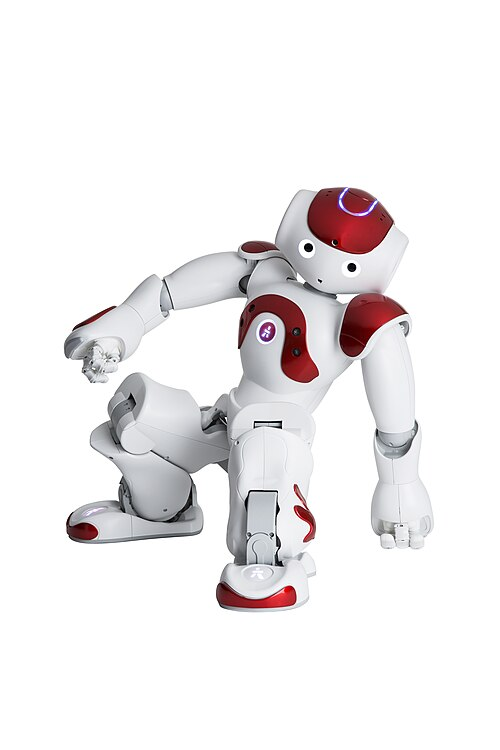
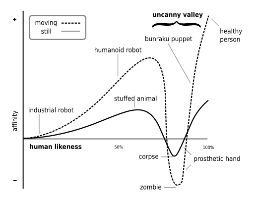

## Recipe for sci-fi prototyping

Scenario based design can be considered a user-centered design approach which is often utilized early in the development process. The technique relies on the creation of stories and scenarios to explore possible interactions between users and technology[^1]. On the Stanford website[^2] a scenario-based framework by Rosson and Corroll can be found in which the workflow of the framework is described. First the problem space is analyzed during which the designers should analyze the stakeholders and claims about the current practices. After this, Different scenarios can be created in which people using technology play a central role in the analysis of how the technology could possibly reshape the user’s activity. 

When reviewing the approach of Johnson for sci-fi prototyping as described on the provided Wikipedia page[^3] some major difference can be found. First, the approach of Johnson allows for the exploration and creation of a lot of different futures. In contrast to the user-centered design approach as mentioned above, the workflow of Johnson does not focus on only products. In addition to this, the work of Johnson loosens the need to first investigate the problem space by allowing the designed to pick their own science and to build their own world. This would suggest that the recipe of Johnson is less grounded in the real world, however, by identifying scientific inflections points a scientific grounding is created. Lastly, the process of Johnson encourages reflection on the products, process or societal developments. This is in stark contrast to the scenario-based framework in which the usability and possible specifications are explored. 

[^1]: C. Stiles-Shields, ‘Scenario Based Design’, in Encyclopedia of Behavioral Medicine, M. Gellman and J. R. Turner, Red., New York, NY: Springer, 2017, pp. 1-4. doi: 10.1007/978-1-4614-6439-6_101954-1.
[^2]: ‘Scenario-based design overview’. Accessed: May 6th 2025. [Online]. Available at: https://web.archive.org/web/20180621145854/http:/ldt.stanford.edu/~gimiller/Scenario-Based/scenarioIndex2.htm
[^3]: ‘Science fiction prototyping’, Wikipedia. 6 september 2024. Accessed: May 6th 2025. [Online]. Availabe at: https://en.wikipedia.org/w/index.php?title=Science_fiction_prototyping&oldid=1244336908

## 21st century robot project

!!! quote

    “21st Century Robot Manifesto - A Robot Is: Imagined first. Easy to build. Completely open source. Fiercely social. Intentionally iterative. Filled with humanity and dreams. Thinking for her/him/itself.”

When reviewing the manifesto as described on the website of the 21st Century robot project[^4], initiated by Johnson, an emphasis on the social, opensource, iterative and almost human-like features can be identified. This focus leads to a humanoid, social robot design with a high acceptance rate in mind and therefore, a similar design to the NAO robot can be seen. This NAO robot is developed by ALDEBARN[^5] with the aim of naturally interacting with humans. 

The story could have evolved differently when the main focus of the robot had shifted from social and human-like to a more functional utilization. This would make the need for a socially approachable robot inferior to a more functional, or function specific robot resulting in a totally different design.

/// caption
The NAO robot performing breakdance, from S.R.Europe on WikiMedia[^6]
///

[^4]: ‘21st Century Robot | History’, 21st-century-robot. Accessed: May 6th 2025. [Online]. Available at: https://www.21stcenturyrobot.com/history
[^5]: ‘Aldebaran - Nao6’, Aldebaran. Accessed: May 6th 2025. [Online]. Available at: https://aldebaran.com/en/nao6/
[^6]: S. R. Europe, Français :  NAO Robot. 2016. Accessed: May 6th  2025. [Online]. Available at: https://commons.wikimedia.org/wiki/File:NAO_Robot_.jpg

## Consumer stories

During the lecture several videos were shown in which robots successfully completed tasks, danced and showed great emotional understanding. This image is common and showcases the evolution of the field of robotics and human machine interaction. 

However, some caution is needed. The videos, stories and images show approachable robots, functional robots and (emotional) intelligent robots, which can lead to a distorted view on the capabilities and nature of the field of robotics. A great example of this is the YouTube video shown during the lecture in which a robot is asked to sort and put away different items. The task is completed in an impressively humanlike manner, showcasing the great advancements of robots and AI. However, the viewer does not know if the AI was trained for this specific task, how many takes it takes to get it right and if the context specific showcased functionality is the only one of the functionalities or the maximum capability of the AI. 

## Importance of storytelling in HRI 

Storytelling can be a great tool during the design process of a social robot since story telling can influence users, inspire innovation and create expectations. These different outcomes can be achieved by utilizing different aspects of story telling.

First, the end results of the story created matters. As already seen in earlier sections, stories can shape the way we think about robots. If only the best possible outcome is chosen, unrealistic expectations might be created with regards to the capabilities of a robot. Secondly, by focusing on the ‘Why’ aspect of a story the needs of the user, the importance of the innovation and the unique selling point of a technology can be conveyed. Lastly, story telling in the field of HRI can be utilized to ensure transparent and understandable science and design. 

When looking at the question of whether uncanny valley can be seen as linked to (a) story one of the above mentioned aspects comes to mind. Expectations: A mismatch between expectations and reality of the story can be identified. A robot is portrayed as human-like, however, as a viewer it becomes clear that something is off, and a sense of uneasiness makes it appearance.  

/// caption
Uncanny valley diagram, from Smurrayinchester on WikiMedia[^7]
///

[^7]: Smurrayinchester, An SVG version of Image:Moriuncannyvalley.gif. 2007. Accessed: May 6th  2025. [Online]. Available at: https://commons.wikimedia.org/wiki/File:Mori_Uncanny_Valley.svg

## Evidence base work vs robot stories

All of the reflective work as described above funnels down to one theme: evidence versus stories. At this point in time, a balance should be created between the true capabilities of robotic systems and the objective, evidence based capabilities. Even though carefully manufactured stories about social robots almost capable of integrating in human society may be longed after, a realistic, honest and transparent robotics case has yet to be presented.  