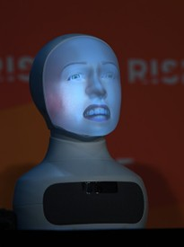
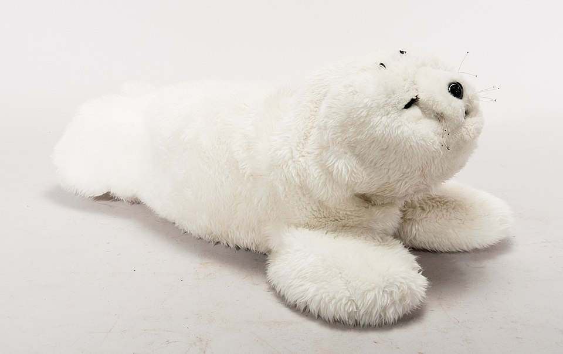

## Is the discussion on embodied agents versus virtual agents still a relevant form? Can you find other (hybrid) shapes too?
The discussion on embodied agents versus virtual agents is in my opinion still a relevant discussion due to the rise in virtual agents and social robots. When is something embodied? During a previous reflection the movie ‘Her’ [^1] raised the question whether Samantha could be considered a social robot. The fact that it was possible to create a deep connection with an agent without conventional physical presence showed that embodied agents can make the same impact as virtual agents. On the other hand, the movie showed that Semantha was physicalized in some way or form by talking though a screen which could be carried around. 

This might suggest that there is a gray area when it comes to embodied agents. Is Semantha embodied because there is a screen? Would Semantha be embodied when she talked through a speaker? And if this is the case, would Semantha be even more embodied when the speaker has some googly eyes attached to it, or a possible picture of Semantha? 

The main question to make a distinction between virtual and embodied agents might be: ‘Which types of communications are possible with a virtual and an embodied agent?’. A good example to answer this question is the Furhat [^2], this is a social robot head which has some movement possibilities. A face is projected from the inside of the robot suggesting that the Furhat might be a virtual agent. However, the Furhat is also able to move and therefore can make head gestures and might be able to convey nonverbal emotion through movements when the Laban movement framework [^3] is applied (As discussed in the reflection of last week). This allows for more meaningful and embodied interactions, something which cannot be achieved via a strictly virtual agent. 

/// caption
Furhat, Form Stephen McCarty sources via WikiMedia' [^4].
/// 

[^2]: ‘Furhat Robotics’. Accessed :May 19th 2025. [Online]. Available at: https://www.furhatrobotics.com/
[^3]: ‘Laban movement analysis’, Wikipedia. September 27th 2024. Accessed May 14th [Online]. Available at: https://en.wikipedia.org/w/index.php?title=Laban_movement_analysis&oldid=1248108012
[^4]: RISEConf, English:  10 July 2019; Furhat Robotics Press Conference in the Media Village during day two of RISE 2019 at the Hong Kong Convention and Exhibition Centre in Hong Kong. Photo by Stephen McCarthy/RISE via Sportsfile. 2019. Accessed: May 19th  2025. [Online]. Available via: https://commons.wikimedia.org/wiki/File:RISE_2019_-_44.jpg

## robotic capabilities vs social aspects of the design
When a product, or a robot, is designed requirements are created beforehand. These requirements specify what a product should be able to do, what its purpose is, how it should function and what it should achieve. 

When a product or robot is designed with only robotic capabilities in mind, different requirements will be created. Relevant questions which can be asked for this purpose are:

-	What should the robot achieve?
-	Which hardware components are needed to create this robot?
-	Are there dimensional restrictions?
-	How do we ensure human safety when working together with the robot?
-	Which software architecture is fitting for our use case?
-	Do we need to take the lifecycle of this robot into account during the design process.

All these questions focus on the capabilities and performance of the robot. After the creation of these requirements, the robot can be developed. This workflow leads to a structured design approach since the requirements are created beforehand via research and client contact. In addition, the requirements can be used to evaluate the robot afterwards. An example of this is the Agile framework [^5] in which the client or customer is centralized in the design process. This ensures that the product meets the functional needs and expectations of the client. 

 When a robot is designed with social aspects in mind, the requirements will shift from pure functional requirements to more user centric requirements. This also means that the main focus of the design methods is not the functional needs of a client, but the needs of a customer. These requirements can be created and formulated in the same structured way as the engineering requirements mentioned above. Design methodologies [^6] which are user centric are for example User Centered Design, Co-design, Accessibility design or Heuristic Evaluation.

These methods shift the focus from the investor/ client to the user and because of this a different set of questions becomes relevant while creating requirements:

-	How would a robot achieve the task?
-	How should a robot be perceived by the user?
-	How will a user interact with the robot?
-	Which features are needed to achieve the task?
-	How can a robot provide understandable feedback?

These questions differ greatly from the engineering centered questions. However, in practice the two approaches, as described above, should both be used when a social robot is designed. 
[^5]: ‘What are Agile frameworks?’, GeeksforGeeks. Accessed: May 19th  2025. [Online]. Available at: https://www.geeksforgeeks.org/what-are-agile-frameworks/
[^6]: Mao, Ji-Ye, et al. "User-centered design methods in practice: a survey of the state of the art." Proceedings of the 2001 conference of the Centre for Advanced Studies on Collaborative research. 2001.

## function defines form' vs social requirements?
Classical examples of robots with a clear conflict in design aspects that come from function defines and from social requirements are industrial robots which are utilized in a social setting. Often a screen is added to it and some speakers, however these robots were not designed to be interactive and social.

A robot which shows a great form fits function is the SPOT robot [^7], this robot is created to walk on rough terrains and due to the design of the robot is doing so very well. It does, however, not always fit the mental picture of people viewing the robot. The robot can be considered cute; however, it is an industrial robot with a lot of power. Since it is not designed or utilized as being cute and interactive, the form does suit the function well.

A robot that is designed to be interactive and social and thus has a good balance between form and function is the Paro robot[^8]. It is fluffy, it is cute, it is approachable due to its form. In addition, the robot seal can react in a social way by tailoring its responds to the users’ needs. 

/// caption
Robotic robot seal, by T. museet/Peter Häll via Wikimedia commons [^9].
/// 

[^7]:]‘Spot’, Boston Dynamics. Accessed: May 19th 2025. [Online]. Available at: https://bostondynamics.com/products/spot/
[^8]: ‘PARO Therapeutic Robot’. Accessed: May 19th 2025. [Online]. Available at: http://www.parorobots.com/
[^9]: T. museet/Peter Häll, Svenska:  Terapeutisk robotsäl ‘Paro’, i hölje av vitt teddytyg. Innehåller sensorer, elektronik och servomotorer för att kunna reagera på beröring. Laddning sker genom munnen, kontakten är maskerad som napp. Knapp för start finns mellan de bakre fenorna. 2018. Accessed May 19th 2025. [Online]. Avaiable at: https://commons.wikimedia.org/wiki/File:Robots%C3%A4len_Paro_TEKS0057912.jpg

## Relevant insights of Duffy with respect to our project case
On the website of Edwin Dertien [^9] a concise summary of the work by Duffy [^10] is provided:

!!! quote

    He argues for the following guiding principles for building social robot embodiment: 

    -	use social conventions and communication in function and form
    -	avoid the uncanny valley
    -	use natural (fluent) motion
    -	balance function and form
    -	balance anthropomorphism and function
    -	allow the robot to portray identity
    -	make sure artificial emotions do not obstruct interaction [^9]

The main idea for our case is to utilize the ROSE robot as a co-amputee. The user can re-learn skills and receive emotional support by talking with ROSE and by ‘going through’ the same struggles. For this case some of the guiding principles are highly relevant. 

First of all, it is mentioned by Duffy that a robot should allow for efficient communication and therefore should have its own mechanics to communicate and have social interaction. It is also mentioned that a robot should be able to develop its own identity, this, combined with the transparent communication, allows people to treat the robot as a socially capable entity. This is especially important for our use case of ROSE in which we want to foster a social connection between the amputee and ROSE as co-amputee. 

This is also strongly linked to the guideline of ensuring that artificial emotions do not obstruct interaction. It is argued by Duffy that the techniques to convey artificial emotions should facilitate social interaction. When ensuring this, the co-amputee might be able to find support via ROSE by having a social connection.

The guideline of balancing function and form is always a relevant guideline, however in our case the robot already exists. Despite this, by tuning into the form of ROSE (A robot with only one arm) the function of ROSE as a co-amputee is still balanced. 
 
[^9]: ‘education:socialrobotdesign:04_embodiment [Electronic Thingies for Fun Stuff]’. Accessed: MAy 18th 2025. [Online]. Available at: https://wiki.edwindertien.nl/doku.php?id=education:socialrobotdesign:04_embodiment
[^10]: B. R. Duffy, ‘Anthropomorphism and the social robot’, Robotics and Autonomous Systems, vol. 42, nr. 3-4, pp. 177-190, mrt. 2003, doi: 10.1016/S0921-8890(02)00374-3.
